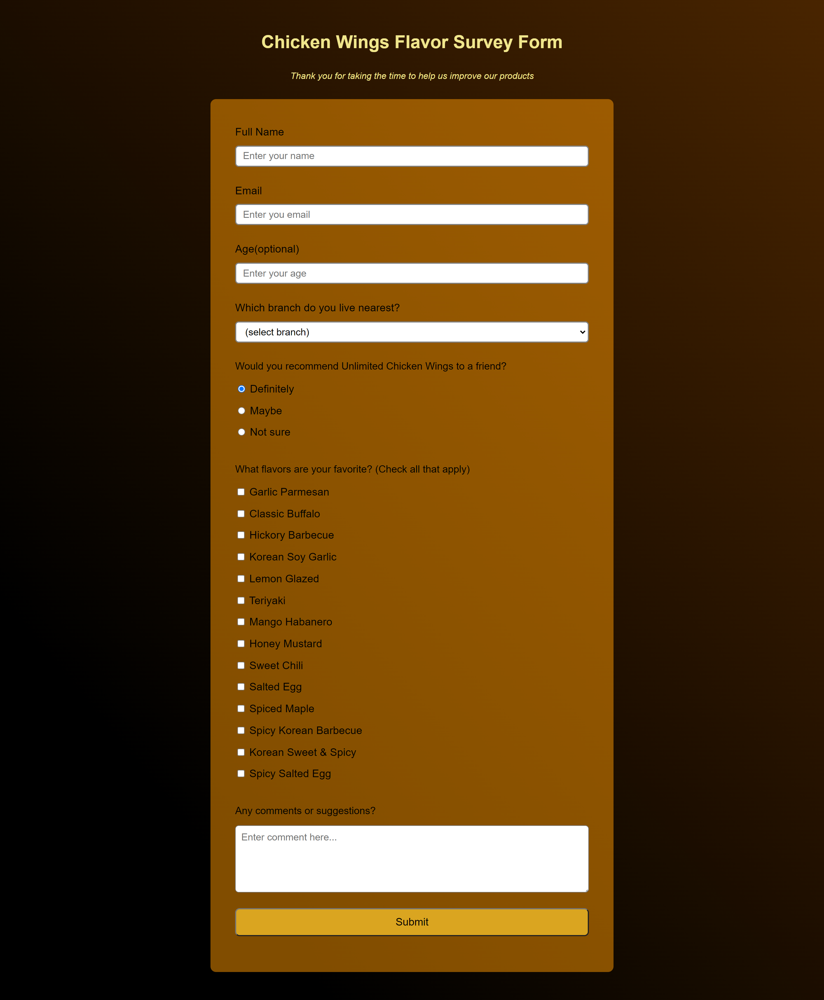

# Survey-Form

## Table of contents

- [Overview](#overview)
  - [The challenge](#the-challenge)
  - [Screenshot](#screenshot)
  - [Links](#links)
- [My process](#my-process)
  - [Built with](#built-with)
- [Author](#author)

## Overview

### The challenge

Users should be able to:

- View the optimal layout for the component depending on their device's screen size

### Screenshot

### Links

- Solution URL: [https://github.com/aljersulit/survey-form](https://github.com/aljersulit/survey-form)
- Live Site URL: [https://aljersulit.github.io/survey-form/](https://aljersulit.github.io/survey-form/)

## My process

### Built with

- Semantic HTML5 markup
- CSS custom properties
- Flexbox

## Author

- Website - [Aldrin Sulit](https://github.com/aljersulit)
